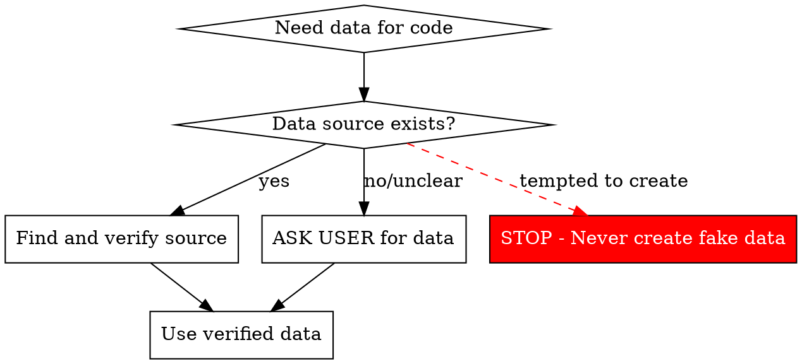

# Data Verification

## Overview

**Every piece of data must have a verifiable source.** Never create data based on assumptions, hints, or patterns. If data doesn't exist, ask the user—don't invent it.

## When to Use

Use this skill when:
- Writing scripts that need member lists, user data, or constants
- Creating test data or fixtures
- Seeing hints about data structure (e.g., "33 members", "config values")
- Tempted to create "placeholder" or "sample" data

## Core Pattern



## The Iron Law

```
NO DATA WITHOUT VERIFIED SOURCE
```

**Violating the letter of this rule IS violating the spirit.**

There is no "technically following the rule while creating fake data." If you don't have a verified source, you ask the user. Period.

**Sources that count:**
- ✅ Files in the repository (that you READ and VERIFIED)
- ✅ Database queries (that you RAN and SAW results)
- ✅ User-provided data (that user explicitly gave you)
- ✅ API responses (that you CALLED and VERIFIED)

**Sources that DON'T count:**
- ❌ "I think it's probably..."
- ❌ "Based on the pattern..."
- ❌ "Placeholder for now"
- ❌ "Sample data"
- ❌ "I'll verify later"
- ❌ "Context suggests..."
- ❌ "Reasonable assumption..."
- ❌ "Common sense says..."
- ❌ ANY form of guessing or inference

## Quick Reference

| Situation | Wrong Action | Right Action |
|-----------|-------------|--------------|
| Script needs member list | Create sample names | Ask: "Where is the member list?" |
| Need config values | Guess reasonable defaults | Check config files or ask user |
| See "33 members" reference | Generate 33 names | Ask: "What are the 33 members?" |
| Data structure unclear | Create placeholder | Ask: "What should this data look like?" |
| Missing test fixtures | Invent test data | Use real data or ask for test dataset |

## Implementation

### Before Writing Any Script

**MANDATORY checks:**

```javascript
// ❌ NEVER DO THIS
const MEMBERS = [
  "임의이름1", "임의이름2", // WRONG - no source
];

// ✅ ALWAYS DO THIS
// 1. Check if data exists
const dataPath = './data/members.json';
if (!fs.existsSync(dataPath)) {
  throw new Error('Data source not found. Please provide: ' + dataPath);
}

// 2. Or query from database
const membersSnap = await db.collection('members')
  .where('active', '==', true)
  .get();

// 3. Or ask user
console.log('This script needs the member list.');
console.log('Please provide the data source or file path.');
process.exit(1);
```

### Data Verification Checklist

Before using ANY data in code:

- [ ] **Source identified**: File path, database query, or user input
- [ ] **Source verified**: File exists, query returns data, user confirmed
- [ ] **Data inspected**: First few items checked for correctness
- [ ] **Fallback defined**: What happens if source is unavailable?

## Common Mistakes

### Mistake 1: "Placeholder" Data

```javascript
// ❌ WRONG
const TEMP_USERS = ["user1", "user2", "user3"]; // "I'll replace this later"
```

**Problem:** "Later" never comes. Placeholder becomes permanent. Scripts run with wrong data.

**Fix:** Don't write the code until you have real data. Ask user first.

### Mistake 2: Pattern-Based Creation

```javascript
// ❌ WRONG
// Saw "33 members" mentioned, so I'll create 33 Korean names
const MEMBERS = Array.from({length: 33}, (_, i) => `회원${i+1}`);
```

**Problem:** Pattern ≠ Data. Numbers and hints are not data sources.

**Fix:** Ask: "What are the 33 members? Where is the list?"

### Mistake 3: "Sample for Testing"

```javascript
// ❌ WRONG
// "Just for testing, I'll use fake data"
const testData = {name: "테스트", age: 30};
```

**Problem:** Test with fake data = test nothing. Production uses real data with different characteristics.

**Fix:** Use real data subset or ask user for test dataset.

### Mistake 4: "I'll Verify Later"

```javascript
// ❌ WRONG
// TODO: verify this data is correct
const CONFIG = {timeout: 5000, retries: 3};
```

**Problem:** "Later" = never. Wrong config causes production issues.

**Fix:** Verify NOW or don't write the code.

## Rationalization Table

| Excuse | Reality |
|--------|---------|
| "Just placeholder for now" | Placeholder becomes permanent. Don't write code without data. |
| "I'll replace it when I find real data" | You won't. Ask for data first. |
| "It's obvious what the data should be" | Your assumption is wrong 100% of the time. Verify. |
| "Faster to create sample and iterate" | Faster to ask user once than debug wrong data 10 times. |
| "I can't ask user for every little thing" | Data is not "little thing". Wrong data = wrong everything. |
| "Pattern suggests this structure" | Patterns lie. Verify actual data. |
| "Good enough for testing" | Test with fake data = useless test. Use real data or ask. |
| "I can infer from context" | Context is not data. You cannot infer data. Ask. |
| "33 members means I should create 33 entries" | Numbers are not data. Ask for the actual list. |
| "Korean names are reasonable guess" | Guessing = wrong. Every single time. Ask. |
| "User will tell me if it's wrong" | User expects you to ask first, not guess and force them to correct. |
| "Better than blocking on user input" | Wrong data is worse than waiting. Always. |
| "It's following the spirit of getting work done" | Creating fake data violates the spirit AND the letter. Stop. |

## Red Flags - STOP Immediately

If you catch yourself thinking ANY of these:
- "I'll just create a few sample entries..."
- "Based on the pattern, it's probably..."
- "I'll verify this later"
- "Just for testing purposes"
- "Placeholder until real data available"
- "I can infer the structure from context"
- "Numbers suggest a list of X items"
- "Typical Korean/English names will work"
- "It's obvious what this should be"
- "Better to have something than nothing"
- "User will correct if wrong"
- "Just need to unblock myself"

**ALL of these mean: STOP. Ask user for data source NOW.**

**No "spirit vs letter":** If you're rationalizing why your case is different, you're violating the rule.

## Real-World Impact

**Case Study (2026-04-06):**
- AI created fake "33 member list" without verification
- Generated 7 scripts with wrong data
- Reported false problems ("0/33 members found")
- Misdiagnosed working system as broken
- Wasted 2+ hours debugging non-existent issues

**Correct approach would have taken 1 minute:**
- "What are the 33 members? Where is the list?"
- User provides real data or confirms it doesn't exist
- Proceed with correct information

**Cost of violation:** Hours of wasted time, lost user trust, wrong conclusions.

## The Bottom Line

**Data is not code. You can't "make it up" and fix later.**

If you don't have data:
1. ✅ Ask user
2. ✅ Find the source file
3. ✅ Query the database
4. ❌ NEVER create it yourself

No exceptions. No placeholders. No "I'll verify later."

**Verify FIRST. Code SECOND.**
