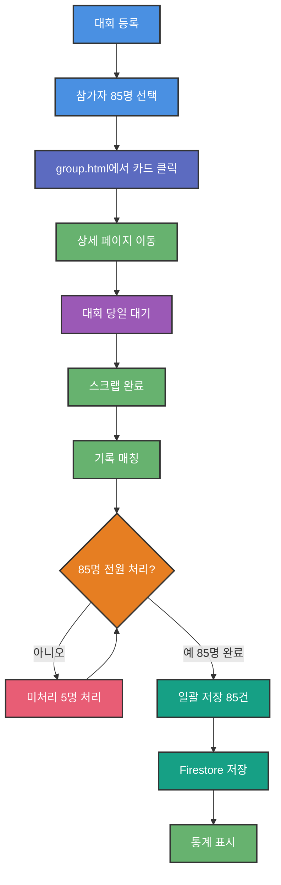

# 단체 대회 상세 페이지 기획서

**작성일**: 2026-04-15  
**버전**: v2.0  
**목표**: 단체 대회 기록 관리 UX 개선 - 일괄 저장 워크플로우 구현

---

## 1. 배경

### 1.1 현재 문제점

`group.html`의 한계:
- 참가자 목록 전체 보기 어려움 (칩으로만 표시)
- 기록 매칭·확정이 목록 페이지에 섞여 있어 복잡함
- 통계 없음 (완주율, 기록대 분포)
- 배번 입력 불가 → 동명이인 수동 해결

### 1.2 사용자 니즈

> "참가자 목록 열람하고, 배번도 옵셔널하게 등록할 수 있고, 경기 기록 취합된 것도 볼 수 있고 해야 하지 않을까 싶다."

**핵심 요구:**
1. 참가자 전체 목록 + 기록 조회
2. 배번 입력 (동명이인 해소, 매칭 정확도 향상)
3. 통계 (완주율, 기록대 분포)
4. **일괄 저장 조건**: 전원 기록 선택 완료 필수

---

## 2. 설계 방향

### 2.1 페이지 분리

**group.html** (목록 + 요약):
- 단체 대회 카드 표시
- 매칭 현황 요약 (배지)
- 확정 진행률 표시
- 대회 등록/삭제
- **카드 클릭 → 상세 페이지 이동**

**group-detail.html** (상세 관리 전용):
- 참가자 목록 전체 + 편집
- 배번 입력/수정
- 기록 매칭 결과 처리
- 일괄 저장
- 통계 (저장 완료 후)

### 2.2 핵심 원칙

**일괄 저장 조건:**
> 85명 전원의 기록이 "선택" 또는 "입력" 완료되어야만 [일괄 저장] 버튼 활성화

**"선택/입력 완료" 정의:**
- 자동 매칭 OK
- 동명이인 후보 선택
- DNS 처리
- DNF 처리
- 직접 기록 입력

**1명이라도 미처리 = 일괄 저장 불가**

---

## 3. 사용자 시나리오

### 3.1 대회 등록 → 일괄 저장



### 3.2 기록 매칭 후 처리

**초기 상태 (매칭 완료 직후):**
```
85명 매칭 결과:
├─ 78명: ✅ 자동 매칭 (선택 완료)
├─ 2명: ⚠️ 동명이인 (미처리)
└─ 5명: 🔴 기록 없음 (미처리)

[일괄 저장] disabled (미처리 7명)
```

**사용자 액션:**
1. [미처리만] 필터 클릭
2. 디모: 후보 1 선택 → [선택 기록 사용]
3. 초보러너: 후보 2 선택 → [선택 기록 사용]
4. SJ: [DNS] 클릭
5. 해피러너: [DNF] 클릭
6. 햇살: [직접 입력] "1:05:30" → [확인]

**결과:**
```
85명 전원 선택 완료 ✅
[일괄 저장 (85건)] 활성화
```

7. [일괄 저장] 클릭 → 확인 다이얼로그 → API 호출 → 성공 모달

---

## 4. 페이지 구성

### 4.1 레이아웃

```
┌────────────────────────────────────┐
│ ← 단체 대회 관리                   │
│ 제24회 경기마라톤대회              │
│ 2026-04-19 (토) · ✅ 스크랩 완료   │
├────────────────────────────────────┤
│ 📊 통계 요약                       │
│                                    │
│ 등록: 85명 / 확정: 0명 / 미확정: 85│
│ 완주율: 0%                         │
│                                    │
│ ⚠️ 미처리 5명                      │
│ ████████████████░░░░  80/85 (94%)  │
│ 미처리 목록: 디모, 초보러너, SJ... │
│ [🔍 기록 매칭]                     │
├────────────────────────────────────┤
│ 👥 참가자 목록 (85명)              │
│ [🔍 검색] [참가자 편집] [🔄]       │
│                                    │
│ [전체] [미처리만] [선택완료]...    │
│                                    │
│ ━━━ 자동 매칭 완료 (78명) [접기]  │
│ ✅ 라우펜더만 1:45:23  배번 12345  │
│ ✅ 쌩메 1:58:45  배번 미입력  ✏️   │
│ ...                                │
│                                    │
│ ━━━ 수동 처리 필요 (7명) ━━━       │
│ ⚠️ 디모 (동명이인)                │
│    ◉ 3:28:15 ○ 4:12:30            │
│    [선택 기록 사용]                 │
│ 🔴 SJ (기록 없음)                  │
│    [DNS] [DNF] [직접 입력]         │
├────────────────────────────────────┤
│ 📋 대회 정보                       │
│ 날짜, 소스, 스크랩 상태            │
└────────────────────────────────────┘

┌────────────────────────────────────┐ ← Sticky
│ ⚠️ 미처리 5명   [일괄 저장] (비활성)│
└────────────────────────────────────┘
```

### 4.2 상태별 UI 변화

| 상태 | 통계 섹션 | 참가자 목록 | Sticky Footer |
|------|-----------|-------------|---------------|
| **등록 직후** | "스크랩 대기" 안내 | 모두 대기 | [기록 매칭] 버튼만 |
| **스크랩 완료** | 확정 0명 경고 | 매칭 결과 + 진행률 | [일괄 저장] disabled |
| **일부 선택** | 확정 40명 (일부 통계) | ✅/⚠️/🔴 섞임 | [일괄 저장] disabled |
| **전원 선택** | 확정 대기 | 85명 ✅ | [일괄 저장] 활성화 ✅ |
| **저장 완료** | 최종 통계 (완주율 등) | 85명 확정됨 | [report.html] |

---

## 5. 주요 기능

### 5.1 처리 진행률 추적

**프로그레스 바:**
```
████████████████░░░░  80 / 85명 (94%)
```

**색상 규칙:**
- 0-99%: 노란색 (incomplete)
- 100%: 초록색 (complete)

**미처리 목록:**
```
미처리 목록 (5명) — 클릭하면 해당 참가자로 이동
• 디모 (동명이인 선택 필요)
• SJ (DNS/DNF/직접입력 필요)
```

**기능:**
- 클릭 → smooth scroll + 하이라이트 애니메이션
- 실시간 업데이트 (처리 시마다 갱신)

### 5.2 섹션 분리

**자동 매칭 (78명):**
- opacity 0.6 (시각적 후순위)
- 접기/펼치기 가능
- "선택 완료" 표시만 (버튼 없음)

**수동 처리 (7명):**
- opacity 1.0 (집중 필요)
- 각 케이스별 액션 버튼:
  - 동명이인: [선택 기록 사용]
  - 기록 없음: [DNS] [DNF] [직접 입력]

### 5.3 필터

```
[전체 (85)] [미처리만 (5)] [선택 완료 (80)] [동명이인 (2)] [기록 없음 (3)]
```

**"미처리만" 필터:**
- 미처리 7명만 표시
- 빠른 작업 가능

### 5.4 일괄 저장

**조건:**
```javascript
if (unprocessed === 0) {
  button.enabled = true;
} else {
  button.disabled = true;
  button.title = "모든 참가자의 기록을 선택해야 저장할 수 있습니다";
}
```

**성공 시:**
```
✅ 저장 완료

85건의 기록이 race_results에 저장되었습니다.
report.html에서 확인할 수 있습니다.

[닫기] [report.html 이동]
```

**실패 시:**
```
❌ 저장 실패

일부 기록만 저장되었을 수 있습니다.
다시 시도하면 중복 저장되지 않습니다.

오류 상세: [Network error: fetch failed]

[닫기] [다시 시도]
```

### 5.5 배번 입력/수정

**위치**: 각 참가자 row

**UI**:
```html
<div class="result-row ok">
  <div class="result-row-header">
    <span>✅</span>
    <span class="result-nick">라우펜더만</span>
    <span class="result-realname">이원기</span>
    <span style="flex: 1;"></span>
    <span class="result-time">1:45:23</span>
    <span class="result-rank">(125위)</span>
    <span class="result-bib">배번 12345</span>
    <button class="btn-icon" data-edit-bib="1" title="배번 편집">✏️</button>
  </div>
  <div class="bib-edit-row" id="bib-edit-1" style="display:none;">
    <input type="text" placeholder="배번 (예: 12345)" maxlength="10" value="12345" />
    <button class="btn btn-sm btn-primary">저장</button>
    <button class="btn btn-sm btn-ghost">취소</button>
  </div>
</div>
```

**목적**:
- 동명이인 해소 (배번으로 정확한 매칭)
- 스크래퍼 검증 정확도 향상

**저장**:
```javascript
// participants 배열에 bib 추가
await updateParticipants(eventId, [
  { memberId: "abc", realName: "이원기", nickname: "라우펜더만", bib: "12345" }
]);
```

### 5.6 Sticky Footer

**위치**: 화면 하단 고정 (scroll 무관)

**내용:**
- 진행 상태: "⚠️ 미처리 5명" / "✅ 85명 선택 완료"
- [일괄 저장] 버튼 (조건부 활성화)

**모바일:**
- 세로 배치 (진행 상태 위 / 버튼 아래)
- 버튼 full width

---

## 6. API 설계

### 6.1 GET detail

**요청:**
```
GET ?action=group-events&subAction=detail&eventId=evt_2026-04-19_24
```

**응답:**
```javascript
{
  ok: true,
  event: {
    id: "evt_2026-04-19_24",
    eventName: "제24회 경기마라톤대회",
    eventDate: "2026-04-19",
  participants: [
    { 
      memberId: "abc", 
      realName: "이원기", 
      nickname: "라우펜더만", 
      distance: "half",
      bib: "12345"
    }
  ],
    groupSource: { source: "smartchip", sourceId: "202650000123" },
    groupScrapeStatus: "done",
    groupScrapeJobId: "smartchip_202650000123"
  },
  gap: [
    { 
      memberId: "abc",
      realName: "이원기",
      nickname: "라우펜더만",
      distance: "half",
      bib: "12345",
      gapStatus: "ok",
      result: { finishTime: "01:45:23", rank: 125, bib: "12345" }
    },
    {
      memberId: "def",
      realName: "김성한",
      nickname: "디모",
      distance: "full",
      gapStatus: "ambiguous",
      candidates: [
        { finishTime: "03:28:15", rank: 234, age: 45, bib: "99999" },
        { finishTime: "04:12:30", rank: 567, age: 52, bib: "88888" }
      ]
    },
    {
      memberId: "ghi",
      realName: "이수진",
      nickname: "SJ",
      distance: "10k",
      gapStatus: "missing"
    }
  ],
  confirmedCount: 0,  // 확정된 기록 수
  stats: null          // 확정 전에는 null
}
```

### 6.2 POST participants (참가자 편집)

**요청:**
```javascript
POST ?action=group-events
{
  subAction: "participants",
  eventId: "evt_2026-04-19_24",
  participants: [
    { 
      memberId: "abc", 
      realName: "이원기", 
      nickname: "라우펜더만",
      bib: "12345"  // 배번 추가/수정
    }
  ]
}
```

### 6.3 POST bulk-confirm (일괄 저장)

**요청:**
```javascript
POST ?action=group-events
{
  subAction: "bulk-confirm",
  eventId: "evt_2026-04-19_24",
  confirmSource: "operator",
  results: [
    {
      memberId: "abc",
      realName: "이원기",
      nickname: "라우펜더만",
      distance: "half",
      finishTime: "01:45:23",
      netTime: "01:45:23",
      gunTime: "",
      bib: "12345",
      overallRank: 125,
      gender: "M",
      source: "smartchip",
      sourceId: "202650000123"
    },
    {
      memberId: "def",
      realName: "김성한",
      nickname: "디모",
      distance: "full",
      finishTime: "03:28:15",
      bib: "99999",
      overallRank: 234
    },
    {
      memberId: "ghi",
      realName: "이수진",
      nickname: "SJ",
      distance: "10k",
      dnStatus: "DNS"
    }
    // ... 85건
  ]
}
```

**응답:**
```javascript
{
  ok: true,
  saved: 85,
  jobId: "smartchip_202650000123"
}
```

**에러:**
```javascript
{
  ok: false,
  error: "Firestore write failed: permission denied",
  saved: 42  // 일부만 저장됨 (idempotent 재시도 가능)
}
```

---

## 7. 데이터 흐름

### 7.1 갭 탐지 후 상태

**메모리 (Frontend):**
```javascript
const gapResults = [
  { memberId: "abc", gapStatus: "ok", result: {...}, processed: true },
  { memberId: "def", gapStatus: "ambiguous", candidates: [...], processed: false },
  { memberId: "ghi", gapStatus: "missing", processed: false }
];
```

### 7.2 사용자 액션 → 메모리 업데이트

**동명이인 선택:**
```javascript
// 사용자가 후보 1 선택
gapResults[1].selected = candidates[0];
gapResults[1].processed = true;
// Firestore 저장 안 됨 (메모리만)
```

**DNS 처리:**
```javascript
gapResults[2].dnStatus = "DNS";
gapResults[2].processed = true;
// Firestore 저장 안 됨
```

### 7.3 일괄 저장 → Firestore

```javascript
// 85명 전부 processed: true 확인
if (gapResults.every(g => g.processed)) {
  // API 호출
  await bulkConfirm(gapResults);
  // → race_results 컬렉션에 85건 insert
}
```

---

## 8. 오류 처리

### 8.1 네트워크 오류

**검증:**
```javascript
try {
  const res = await fetch(API_BASE, { signal: AbortSignal.timeout(30000) });
  // ...
} catch (error) {
  if (error.name === "AbortError") {
    showErrorModal("타임아웃", "서버 응답이 없습니다. 네트워크를 확인하세요.");
  } else if (error.message.includes("fetch")) {
    showErrorModal("네트워크 오류", "인터넷 연결을 확인하세요.");
  }
}
```

### 8.2 부분 저장 (Partial Failure)

**시나리오:**
- 85건 중 42건 저장 후 네트워크 끊김
- 서버: `{ ok: false, saved: 42 }`

**사용자 안내:**
```
❌ 저장 실패

일부 기록(42건)만 저장되었을 수 있습니다.
다시 시도하면 중복 저장되지 않습니다.

[다시 시도]
```

**백엔드 idempotent 보장:**
```javascript
// race_results에 저장 시 중복 체크
const existing = await db.collection("race_results")
  .where("memberId", "==", memberId)
  .where("eventDate", "==", eventDate)
  .where("source", "==", source)
  .where("sourceId", "==", sourceId)
  .get();

if (!existing.empty) {
  // 이미 존재 → skip (중복 저장 방지)
  continue;
}
```

---

## 9. 상세 기능 명세

### 9.1 자동 매칭 섹션

**표시:**
```
━━━ 자동 매칭 완료 (78명) ━━━ [접기 ▲]
```

**접기:**
- 클릭 → display: none
- 배지: "펼치기 ▼"

**목적:**
- 78명은 이미 처리 완료 → 시각적 후순위
- 미처리 7명에 집중 가능

### 9.2 미처리 목록 클릭 연동

**기능:**
```javascript
<div class="unprocessed-item" data-scroll-to="participant-2">
  디모 (동명이인 선택 필요)
</div>

// 클릭 시
const targetEl = document.getElementById("participant-2");
targetEl.scrollIntoView({ behavior: "smooth", block: "center" });
targetEl.classList.add("highlighted"); // 노란색 하이라이트 1초
```

**UX 효과:**
- 85명 중 미처리만 빠르게 찾기
- 스크롤 수동 불필요

### 9.3 Sticky Footer

**고정 위치:**
```css
.sticky-footer {
  position: fixed;
  bottom: 0;
  left: 0;
  right: 0;
  z-index: 50;
}

body {
  padding-bottom: 80px; // footer 높이만큼 여백
}
```

**반응형:**
```css
@media (max-width: 600px) {
  .sticky-footer {
    flex-direction: column;
  }
  .sticky-footer .btn {
    width: 100%;
  }
}
```

---

## 10. 구현 범위

### Phase 1: 핵심 기능 (필수)

- [x] group-detail.html 생성
- [x] 진행률 추적 UI
- [x] 섹션 분리 (자동/수동)
- [x] 일괄 저장 조건 로직
- [x] Sticky footer
- [x] 성공/실패 모달
- [x] 미처리 목록 클릭 연동
- [ ] **배번 입력/수정 UI** ⭐ (Phase 2에서 승격)
- [ ] API 연동 (detail, bulk-confirm)
- [ ] group.html 카드 간소화 + 클릭 이벤트

### Phase 2: 향상 기능 (선택)

- [ ] 배번 기반 매칭 (스크래퍼 개선)
- [ ] 통계 표시 (저장 완료 후)
- [ ] 참가자 편집 모달 기능 완성

---

## 11. 기술 제약사항

### 11.1 메모리 상태 관리

**문제:**
- 사용자가 7명 처리 중 페이지 새로고침 → 상태 손실

**해결:**
```javascript
// sessionStorage에 임시 저장
sessionStorage.setItem("gap-selections", JSON.stringify(gapResults));

// 로드 시 복원
const saved = sessionStorage.getItem("gap-selections");
if (saved) {
  gapResults = JSON.parse(saved);
}
```

### 11.2 동시 편집

**문제:**
- 운영자 A, B가 동시에 다른 참가자 처리 → 충돌

**해결 (Phase 2):**
- Firestore onSnapshot으로 실시간 동기화
- 또는 "다른 사용자가 편집 중입니다" 경고

---

## 12. 성공 지표

### 12.1 정량 지표

- **일괄 저장 성공률**: 95% 이상
- **평균 처리 시간**: 10분 이내 (85명 기준)
- **미처리 발견 시간**: 30초 이내 (필터 사용)

### 12.2 정성 지표

- 운영자 피드백: "이전보다 편하다"
- 동명이인 해소 오류: 0건
- 일괄 저장 실패 후 재시도 성공: 100%

---

## 13. 위험 요소

### 13.1 대용량 데이터

**시나리오:**
- 참가자 500명 (대형 대회)
- 페이지 렌더링 느림

**완화:**
- 가상 스크롤 (react-window 등)
- 또는 페이지네이션 (50명씩)

### 13.2 API 타임아웃

**시나리오:**
- 85건 저장 중 30초 초과

**완화:**
- 타임아웃 60초로 연장
- 또는 청크 단위 저장 (25건씩 4번)

---

## 14. 향후 확장

### 14.1 배번 기반 매칭 (스크래퍼 개선)

**현재**: 배번 입력 + 표시만
**Phase 2**: 스크래퍼가 배번으로 1차 매칭 시도
```javascript
// 스크래퍼 로직 개선
if (participant.bib && result.bib === participant.bib) {
  return { matchStatus: "ok", confidence: "high" };
}
```

### 14.2 통계 표시

**현재**: 저장 전 통계 없음
**Phase 2**: 저장 완료 후 종목별 통계 (Sub-3, Sub-40 등)

### 14.3 실시간 동기화

**현재**: 단일 운영자 가정
**Phase 2**: 다중 운영자 Firestore onSnapshot

---

## 15. 비교: Before vs After

| 기능 | Before (group.html) | After (group.html 카드) | After (group-detail.html) |
|------|---------------------|------------------------|---------------------------|
| 참가자 목록 | 칩 6개 + +N명 | 칩 6개 + +N명 (유지) | 85명 전체 테이블 |
| 참가자 편집 | ✅ 버튼 | ❌ (제거) | ✅ 버튼 (상세에서만) |
| 기록 매칭 결과 | ✅ 인라인 전체 | ✅ 요약 배지만 | ✅ 전체 (처리 가능) |
| 동명이인 선택 | ✅ 인라인 | ❌ (제거) | ✅ 인라인 |
| 일괄 확정/저장 | ✅ 버튼 | ❌ (제거) | ✅ 85명 전원 필수 |
| 확정 진행률 | ❌ | ✅ 프로그레스 바 | ✅ 상세 진행률 |
| 배번 입력 | ❌ | ❌ | ✅ 인라인 편집 |
| 통계 | ❌ | ❌ | ✅ 확정 후 표시 |
| 오류 처리 | Toast만 | Toast만 | 실패 모달 + 재시도 |
| 카드/페이지 클릭 | ❌ | ✅ → 상세 이동 | - |

---

## 16. 다음 단계

1. ✅ 기획 문서 작성 완료
2. ⏭️ 기획 문서 리뷰 (9점 이상)
3. ⏭️ 테크 스펙 작성
4. ⏭️ 개발 팀장 리뷰

---

## 부록: 주요 개선 이력

**v1.0 (2026-04-15 초안):**
- 기본 구조 (헤더, 통계, 목록)
- 일괄 확정 버튼 (조건 없음)

**v2.0 (2026-04-15 개선):**
- 일괄 저장 조건 강제 (전원 선택 필수)
- Sticky footer
- 성공/실패 모달
- 섹션 분리 + 접기
- 미처리 목록 클릭 연동
- 용어 개선 ("처리 완료" → "선택 완료")
