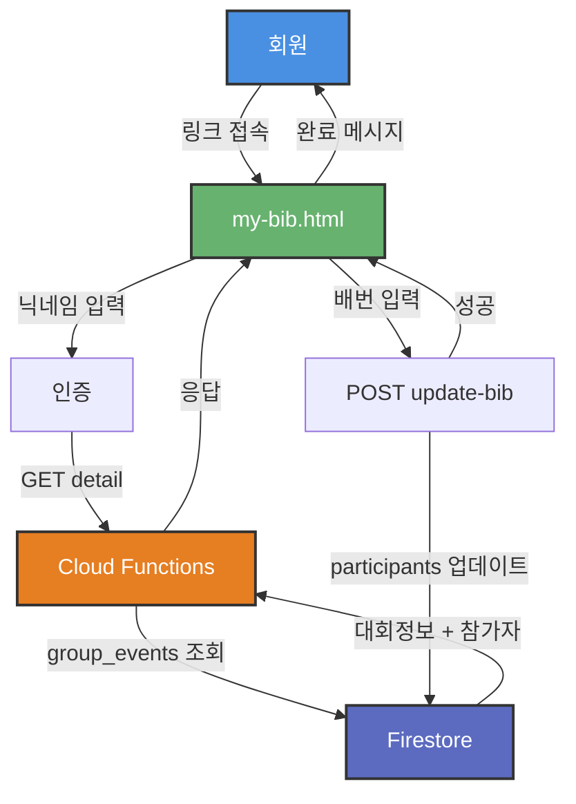

# 테크 스펙 - 회원 셀프 서비스 배번 입력

**작성일**: 2026-04-18  
**버전**: v1.0  
**목표**: 단체 대회 참가자가 본인 배번을 직접 입력하여 운영진 부담 감소 및 동명이인 이슈 해결

---

## 1. 배경

### 1.1 현재 문제점

**단체 대회 운영 시:**
- 85명 참가자의 배번을 운영진이 일일이 입력하기 어려움
- 대회 1일 전 동명이인 이슈 해결을 위해 배번 정보 필수
- 배번 택배가 운영진에게 일괄 도착해도 개별 입력 불가능
- 대회 당일 운영진이 동명이인 수동 매칭에 30분 이상 소요

**동명이인 이슈:**
- 자주 발생하는 사용자는 정해져 있음
- 배번이 있으면 100% 정확한 매칭 가능
- 배번 없으면 나이/기록/성별로 추론 → 오류 가능

### 1.2 솔루션

**회원 셀프 서비스 배번 입력:**
- 회원들이 본인의 배번을 직접 입력
- 운영진은 링크만 공유 (카카오톡 등)
- 입력한 사람만이라도 자동 매칭 → 부분 성공 가능

---

## 2. 아키텍처 개요

### 2.1 시스템 구성

```
my-bib.html             회원 배번 입력 페이지 (신규)
functions/race.js       action=update-bib API (신규)
Firestore               group_events.participants[].bib 업데이트
```

### 2.2 데이터 흐름



---

## 3. 데이터 모델

### 3.1 기존: group_events 컬렉션

```javascript
{
  id: "evt_2026-04-19_24",
  eventName: "제24회 경기마라톤대회",
  eventDate: "2026-04-19",
  participants: [
    {
      memberId: "abc",
      realName: "이원기",
      nickname: "라우펜더만",
      distance: "half",
      bib: "12345"        // ← 기존: 운영진만 입력 가능
    },
    {
      memberId: "def",
      realName: "김성한",
      nickname: "디모",
      distance: "full",
      bib: null           // ← 미입력
    }
  ]
}
```

### 3.2 변경 사항

**변경 없음** - 기존 스키마 그대로 사용  
`participants[].bib` 필드에 회원이 직접 입력한 값 저장

---

## 4. API 설계

### 4.1 GET detail (기존 재사용)

**요청:**
```
GET /race?action=group-events&subAction=detail&eventId=evt_2026-04-19_24
```

**응답:**
```javascript
{
  ok: true,
  event: {
    id: "evt_2026-04-19_24",
    eventName: "제24회 경기마라톤대회",
    eventDate: "2026-04-19",
    participants: [
      { 
        memberId: "abc", 
        nickname: "라우펜더만",
        realName: "이원기",
        distance: "half",
        bib: "12345"
      }
    ]
  }
}
```

**권한:** 공개 (닉네임만 있으면 조회 가능)

---

### 4.2 POST update-bib (신규)

**요청:**
```
POST /race?action=group-events
Content-Type: application/json

{
  "subAction": "update-bib",
  "eventId": "evt_2026-04-19_24",
  "nickname": "디모",       // 회원 식별 (닉네임 또는 memberId)
  "bib": "99999"            // 배번 (문자열)
}
```

**응답 (성공):**
```javascript
{
  ok: true,
  message: "배번이 저장되었습니다"
}
```

**응답 (실패):**
```javascript
{
  ok: false,
  error: "해당 대회에 참가하지 않는 회원입니다"
}
```

**에러 케이스:**
1. `eventId` 없음 → `400 eventId required`
2. `nickname` 없음 → `400 nickname required`
3. `bib` 없음 → `400 bib required`
4. 대회 없음 → `404 event not found`
5. 참가자 아님 → `403 not a participant`
6. Firestore 오류 → `500 server error`

**권한:** 공개 (닉네임만 있으면 수정 가능)  
**보안:** 본인 확인은 닉네임 입력으로 간소화 (MVP)

---

## 5. Frontend 구현

### 5.1 my-bib.html

**역할:** 회원이 본인의 배번을 입력하는 셀프 서비스 페이지

**URL 파라미터:**
```
/my-bib.html?eventId=evt_2026-04-19_24
```

**페이지 구성:**
```
┌─────────────────────────────────────┐
│ 🎽 배번 입력                        │
│ 제24회 경기마라톤대회                │
│ 2026-04-19 (토)                     │
├─────────────────────────────────────┤
│ 📝 본인 확인                         │
│                                     │
│ 닉네임 입력:                        │
│ [           ]  [다음]               │
├─────────────────────────────────────┤
│ ✅ 라우펜더만님 확인되었습니다       │
│                                     │
│ 종목: 하프마라톤                    │
│ 현재 배번: 미입력                   │
│                                     │
│ 배번 번호:                          │
│ [           ]                       │
│                                     │
│ [저장]                              │
├─────────────────────────────────────┤
│ 💡 안내                             │
│ • 배번은 대회 당일 받는 번호판입니다 │
│ • 동명이인 이슈 해결을 위해 필요합니다│
│ • 입력하지 않아도 기록은 저장됩니다   │
└─────────────────────────────────────┘
```

### 5.2 상태 관리

```javascript
let currentEvent = null;      // 대회 정보
let currentParticipant = null; // 참가자 정보

// 단계
const STEP = {
  AUTH: 1,      // 닉네임 입력
  INPUT: 2,     // 배번 입력
  SUCCESS: 3    // 완료
};

let currentStep = STEP.AUTH;
```

### 5.3 핵심 함수

#### loadEvent()
```javascript
async function loadEvent() {
  const urlParams = new URLSearchParams(window.location.search);
  const eventId = urlParams.get('eventId');
  
  if (!eventId) {
    showError('잘못된 접근입니다');
    return;
  }
  
  const res = await fetch(`${API_BASE}?action=group-events&subAction=detail&eventId=${eventId}`);
  const data = await res.json();
  
  if (!data.ok) {
    showError('대회 정보를 불러올 수 없습니다');
    return;
  }
  
  currentEvent = data.event;
  renderEventInfo();
}
```

#### authenticateUser()
```javascript
async function authenticateUser(nickname) {
  const participant = currentEvent.participants.find(
    p => p.nickname === nickname
  );
  
  if (!participant) {
    showError('해당 대회에 참가하지 않는 회원입니다');
    return false;
  }
  
  currentParticipant = participant;
  currentStep = STEP.INPUT;
  renderInputForm();
  return true;
}
```

#### saveBib()
```javascript
async function saveBib(bib) {
  if (!bib || bib.trim() === '') {
    showError('배번을 입력해주세요');
    return;
  }
  
  const res = await fetch(`${API_BASE}?action=group-events`, {
    method: 'POST',
    headers: { 'Content-Type': 'application/json' },
    body: JSON.stringify({
      subAction: 'update-bib',
      eventId: currentEvent.id,
      nickname: currentParticipant.nickname,
      bib: bib.trim()
    })
  });
  
  const data = await res.json();
  
  if (!data.ok) {
    showError(data.error || '저장 실패');
    return;
  }
  
  currentStep = STEP.SUCCESS;
  renderSuccess();
}
```

### 5.4 반응형 레이아웃

```css
@media (max-width: 600px) {
  .wrap {
    padding: 12px;
  }
  
  .page-title {
    font-size: 18px;
  }
  
  input[type="text"] {
    font-size: 16px; /* iOS zoom 방지 */
  }
}
```

---

## 6. Backend 구현

### 6.1 functions/race.js 수정

**기존:**
```javascript
if (action === "group-events") {
  if (subAction === "detail") { ... }
  if (subAction === "gap") { ... }
  if (subAction === "participants") { ... }
  if (subAction === "bulk-confirm") { ... }
}
```

**추가:**
```javascript
if (action === "group-events") {
  // ... 기존 코드 ...
  
  if (subAction === "update-bib") {
    return handleUpdateBib(req, res);
  }
}
```

### 6.2 handleUpdateBib 구현

```javascript
async function handleUpdateBib(req, res) {
  const { eventId, nickname, bib } = req.body;
  
  // 1. 필수 파라미터 검증
  if (!eventId) {
    return res.status(400).json({ ok: false, error: "eventId required" });
  }
  if (!nickname) {
    return res.status(400).json({ ok: false, error: "nickname required" });
  }
  if (!bib || typeof bib !== 'string') {
    return res.status(400).json({ ok: false, error: "bib required" });
  }
  
  // 배번 형식 검증 (길이 제한 없음, 문자열이면 허용)
  const trimmedBib = bib.trim();
  if (trimmedBib === '') {
    return res.status(400).json({ ok: false, error: "bib cannot be empty" });
  }
  
  try {
    // 2. 대회 조회
    const eventDoc = await db.collection("group_events").doc(eventId).get();
    if (!eventDoc.exists) {
      return res.status(404).json({ ok: false, error: "event not found" });
    }
    
    const event = eventDoc.data();
    
    // 3. 참가자 찾기
    const participantIndex = event.participants.findIndex(
      p => p.nickname === nickname
    );
    
    if (participantIndex === -1) {
      return res.status(403).json({ 
        ok: false, 
        error: "not a participant" 
      });
    }
    
    // 4. 배번 업데이트
    event.participants[participantIndex].bib = trimmedBib;
    
    await db.collection("group_events").doc(eventId).update({
      participants: event.participants
    });
    
    // 5. 성공 응답
    return res.json({ 
      ok: true, 
      message: "배번이 저장되었습니다" 
    });
    
  } catch (error) {
    console.error("update-bib error:", error);
    return res.status(500).json({ 
      ok: false, 
      error: "server error" 
    });
  }
}
```

---

## 7. 운영 워크플로우

### 7.1 운영진 액션

**1. 단체 대회 등록 (기존)**
```
group.html → [대회 등록] → 85명 선택
```

**2. 배번 입력 링크 공유 (신규)**
```
카카오톡 메시지:
─────────────────────────
🎽 제24회 경기마라톤대회 배번 입력

대회 당일 기록 매칭을 위해 배번을 입력해주세요.
(1분 소요, 대회 1일 전까지)

👉 https://dmc-log.web.app/my-bib.html?eventId=evt_2026-04-19_24
─────────────────────────
```

**3. 대회 당일 기록 매칭 (기존)**
```
group-detail.html → [기록 매칭]
→ 배번 입력한 사람은 자동 매칭
→ 나머지는 수동 처리
```

### 7.2 회원 액션

**1. 링크 접속**
```
카카오톡 링크 클릭 → my-bib.html
```

**2. 본인 확인**
```
닉네임 입력: "디모" → [다음]
```

**3. 배번 입력**
```
배번 번호: "99999" → [저장]
```

**4. 완료**
```
✅ 저장 완료
대회 기록이 자동으로 매칭됩니다.
```

---

## 8. 오류 처리

### 8.1 Frontend 검증

```javascript
function validateBib(bib) {
  if (!bib || bib.trim() === '') {
    return { valid: false, error: '배번을 입력해주세요' };
  }
  
  // 길이 제한 없음 - 대회별 배번 형식 다양
  // 문자열로 저장 (숫자, 문자+숫자, 알파벳 모두 허용)
  
  return { valid: true };
}
```

### 8.2 네트워크 오류

```javascript
async function saveBib(bib) {
  try {
    const res = await fetch(`${API_BASE}?action=group-events`, {
      method: 'POST',
      headers: { 'Content-Type': 'application/json' },
      body: JSON.stringify({
        subAction: 'update-bib',
        eventId: currentEvent.id,
        nickname: currentParticipant.nickname,
        bib: bib.trim()
      }),
      signal: AbortSignal.timeout(10000) // 10초 타임아웃
    });
    
    if (!res.ok) {
      throw new Error(`HTTP ${res.status}`);
    }
    
    const data = await res.json();
    
    if (!data.ok) {
      showError(data.error || '저장 실패');
      return;
    }
    
    currentStep = STEP.SUCCESS;
    renderSuccess();
    
  } catch (error) {
    if (error.name === 'AbortError') {
      showError('타임아웃: 네트워크를 확인해주세요');
    } else {
      showError('네트워크 오류: 다시 시도해주세요');
    }
  }
}
```

### 8.3 중복 입력

**허용** - 같은 회원이 배번을 여러 번 입력 가능 (덮어쓰기)

**이유:**
- 입력 실수 수정 가능
- 복잡한 중복 체크 불필요

---

## 9. 보안 고려사항

### 9.1 인증 수준

**MVP: 닉네임만 입력 (간소화)**

**장점:**
- 구현 단순
- 회원 편의성 높음
- 링크만 있으면 즉시 입력 가능

**단점:**
- 다른 사람이 대신 입력 가능 (악의적 변조)

**완화:**
- 배번은 대회 당일 확인 가능 (잘못된 배번은 매칭 실패)
- 운영진이 group-detail.html에서 수정 가능
- 악의적 사용 가능성 낮음 (내부 커뮤니티)

### 9.2 Phase 2 개선 (선택)

**Firebase Auth 연동:**
- 회원 로그인 필수
- memberId 기반 본인 확인
- 보안 강화

**구현 범위:**
- MVP에서는 제외
- 악의적 사용 발생 시 추가 검토

---

## 10. 성공 지표

### 10.1 정량 지표 (1주일 측정)

| 지표 | 목표 | 측정 방법 |
|------|------|-----------|
| **배번 입력률** | 30% 이상 | 입력 회원 / 전체 참가자 |
| **운영진 시간 절감** | 10분 이상 | 대회 당일 매칭 소요 시간 |
| **동명이인 오류** | 0건 | 잘못 매칭된 기록 건수 |

### 10.2 정성 지표

- 회원 피드백: "편했다" / "불편했다"
- 운영진 피드백: "시간이 줄었다" / "효과 없었다"

### 10.3 Phase 2 진행 조건

**조건 만족 시 사진 업로드 기능 추가:**
1. 입력률 30% 이상
2. 회원 피드백 "숫자 입력 불편"
3. 운영진 OCR 검수 수용 가능

---

## 11. 구현 범위

### Phase 1: MVP (2-3시간) ⭐ 이번 구현

- [ ] my-bib.html 생성
  - 닉네임 입력 (인증)
  - 배번 입력 폼
  - 성공 메시지
- [ ] API: update-bib 구현
  - 파라미터 검증
  - Firestore 업데이트
  - 에러 처리

**배번 우선 매칭은 Phase 2로 미룸** (기존 이름 매칭으로도 충분)

### Phase 2: 사진 업로드 (선택, 1-2일)

- [ ] Firebase Storage 설정
- [ ] Vision API 연동 (OCR)
- [ ] 사진 업로드 UI
- [ ] OCR 검수 UI (운영진)

---

## 12. 기술 제약사항

### 12.1 배번 형식

**제약 없음** - 문자열로 저장

**이유:**
- 대회별 배번 형식 다양 (숫자, 문자+숫자, 알파벳)
- 유연성 우선

### 12.2 동시 입력

**문제:**
- 운영진이 group-detail.html에서 수정 중
- 회원이 my-bib.html에서 동시 입력
- 충돌 가능

**MVP 전략:**
- **Last Write Wins** (나중 입력이 덮어씀)
- 단순하고 예측 가능
- 실제 충돌 가능성 낮음 (회원은 대회 전, 운영진은 대회 당일)

**Phase 2 개선 (선택):**
- Firestore Transaction 사용
- 또는 "운영진이 수정 중" 락
- 타임스탬프 기반 충돌 감지

### 12.3 대회 종료 후 입력

**허용** - 대회 종료 후에도 배번 입력 가능

**이유:**
- 기록 재확인 시 유용
- 제약 없이 항상 수정 가능

---

## 13. 테스트 시나리오

### 13.1 정상 플로우

```
1. 운영진이 단체 대회 등록 (85명)
2. 링크 공유 (카카오톡)
3. 회원 "디모" 접속 → 닉네임 입력
4. 배번 "99999" 입력 → 저장
5. 성공 메시지 표시
6. Firestore group_events.participants[1].bib = "99999" 확인
7. group-detail.html에서 배번 표시 확인 (매칭 개선은 Phase 2)
```

### 13.2 오류 케이스

| 케이스 | 입력 | 예상 결과 |
|--------|------|-----------|
| 잘못된 eventId | `eventId=invalid` | "대회 정보를 불러올 수 없습니다" |
| 참가자 아님 | `nickname=외부인` | "해당 대회에 참가하지 않는 회원입니다" |
| 배번 미입력 | `bib=""` | "배번을 입력해주세요" |
| 네트워크 끊김 | 저장 중 연결 해제 | "네트워크 오류: 다시 시도해주세요" |
| 중복 입력 | 같은 회원 2번 입력 | 덮어쓰기 (정상) |

### 13.3 엣지 케이스

```
1. 배번에 공백 포함: "  123  " → trim 후 "123" 저장
2. 배번에 특수문자: "A-123" → 허용 (문자열)
3. 매우 긴 배번: "12345678901" → 허용 (길이 제한 없음)
4. 대회 없는 상태에서 입력 → 404 error
5. 동시 입력 (회원+운영진) → Last Write Wins (나중 입력 반영)
```

---

## 14. 배포 계획

### 14.1 배포 순서

```bash
# 1. 코드 작성
my-bib.html
functions/race.js (handleUpdateBib 추가)

# 2. 로컬 테스트
npm run serve  # Firebase Emulator

# 3. 배포
firebase deploy --only hosting  # my-bib.html
firebase deploy --only functions:race  # API

# 4. 검증
curl -X POST "https://asia-northeast3-dmc-attendance.cloudfunctions.net/race?action=group-events" \
  -H "Content-Type: application/json" \
  -d '{"subAction":"update-bib","eventId":"evt_test","nickname":"디모","bib":"99999"}'
```

### 14.2 롤백 계획

**문제 발생 시:**
1. my-bib.html 비활성화 (hosting에서 제거)
2. API는 유지 (group-detail.html에서 사용 중)
3. 기존 group-detail.html 운영진 입력 방식으로 복귀

---

## 15. 향후 확장

### 15.1 사진 업로드 + OCR

**Phase 2 구현 시:**
- Firebase Storage 이미지 저장
- Vision API OCR 처리
- 운영진 검수 UI

### 15.2 배번 기반 매칭 개선

**현재:** 이름 → 배번 순으로 매칭  
**개선:** 배번 우선 매칭 (배번이 있으면 100% 신뢰)

```javascript
// scraper.js 개선 예시
function matchParticipant(participant, scrapedResults) {
  // 1순위: 배번 매칭
  if (participant.bib) {
    const bibMatch = scrapedResults.find(r => r.bib === participant.bib);
    if (bibMatch) {
      return { status: "ok", result: bibMatch, confidence: "high" };
    }
  }
  
  // 2순위: 이름 매칭 (기존 로직)
  const nameMatches = scrapedResults.filter(
    r => r.name === participant.realName
  );
  
  if (nameMatches.length === 1) {
    return { status: "ok", result: nameMatches[0], confidence: "medium" };
  }
  
  if (nameMatches.length > 1) {
    return { status: "ambiguous", candidates: nameMatches };
  }
  
  return { status: "missing" };
}
```

### 15.3 알림 기능

**Phase 3 (선택):**
- 배번 미입력 회원에게 카카오톡 리마인더
- 대회 1일 전 자동 발송

---

## 16. 참고 문서

- [단체 대회 상세 페이지 기획](./2026-04-15-group-detail-page-v2.md)
- [단체 대회 상세 페이지 테크 스펙](../tech-specs/2026-04-15-group-detail-impl.md)
- [데이터 모델](../../docs/DATA_MODEL.md)
- [DMC 아키텍처](.cursor/rules/dmc-architecture.mdc)

---

## 부록: 주요 개선 이력

**v1.0 (2026-04-18 초안):**
- MVP 설계 (텍스트 입력만)
- 닉네임 간소 인증
- update-bib API 설계
- 성공 지표 정의
