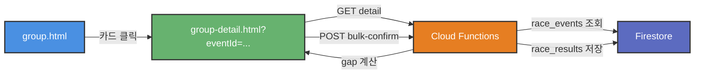

# 테크 스펙 - 단체 대회 상세 페이지

**작성일**: 2026-04-15  
**버전**: v2.0  
**관련 문서**: `2026-04-15-group-detail-page-v2.md` (기획)

---

## 1. 아키텍처 개요

### 1.1 파일 구조

```
group.html              (기존) - 목록 페이지
group-detail.html       (신규) - 상세 페이지
functions/index.js      (수정) - API 2개 추가
```

### 1.2 데이터 흐름



---

## 2. Frontend 구현

### 2.1 group-detail.html

**역할**: 단일 단체 대회의 모든 관리 기능

**주요 컴포넌트:**
1. 헤더 (뒤로가기, 대회명, 날짜)
2. 통계 섹션 (진행률, 미처리 목록)
3. 참가자 목록 (섹션 분리, 필터)
4. Sticky footer (일괄 저장 버튼)
5. 모달 (참가자 편집, 성공, 실패)

### 2.2 상태 관리

**메모리:**
```javascript
let currentEvent = null;    // race_events 문서
let gapResults = [];        // 갭 탐지 결과 + 사용자 선택
let confirmedRecords = [];  // 이미 확정된 기록

// gapResults 구조
[
  {
    memberId: "abc",
    realName: "이원기",
    nickname: "라우펜더만",
    distance: "half",
    gapStatus: "ok",           // ok | ambiguous | missing
    result: {...},             // 자동 매칭 결과
    processed: true,           // 사용자 선택/입력 완료 여부
    selectedCandidate: null,   // 동명이인 선택 시
    dnStatus: null,            // DNS | DNF
    manualTime: null           // 직접 입력 시
  }
]
```

**sessionStorage (새로고침 대응):**
```javascript
// 저장
function saveGapState() {
  sessionStorage.setItem(`gap-${eventId}`, JSON.stringify(gapResults));
}

// 복원
function restoreGapState(eventId) {
  const saved = sessionStorage.getItem(`gap-${eventId}`);
  if (saved) {
    gapResults = JSON.parse(saved);
    updateProgressUI();
  }
}
```

### 2.3 핵심 함수

#### analyzeProcessingStatus()
```javascript
function analyzeProcessingStatus() {
  const stats = {
    total: gapResults.length,
    processed: 0,
    unprocessed: 0,
    unprocessedList: []
  };

  gapResults.forEach((g, idx) => {
    const isProcessed = 
      (g.gapStatus === "ok") ||                    // 자동 매칭
      (g.gapStatus === "ambiguous" && g.selectedCandidate != null) ||
      (g.gapStatus === "missing" && (g.dnStatus || g.manualTime));
    
    if (isProcessed) {
      stats.processed++;
    } else {
      stats.unprocessed++;
      stats.unprocessedList.push({
        idx,
        nick: g.nickname,
        realName: g.realName,
        reason: g.gapStatus === "ambiguous" ? "동명이인 선택 필요" : "DNS/DNF/직접입력 필요"
      });
    }
  });

  return stats;
}
```

#### updateProgressUI()
```javascript
function updateProgressUI() {
  const stats = analyzeProcessingStatus();
  const percentage = Math.round((stats.processed / stats.total) * 100);
  
  // 프로그레스 바
  progressFill.style.width = percentage + "%";
  progressFill.textContent = `${stats.processed} / ${stats.total}명 (${percentage}%)`;
  
  // 색상
  if (percentage === 100) {
    progressBar.classList.add("complete");
    progressFill.classList.add("complete");
  } else {
    progressBar.classList.remove("complete");
    progressFill.classList.remove("complete");
  }
  
  // 일괄 저장 버튼
  const bulkBtn = document.getElementById("bulkConfirmBtn");
  bulkBtn.disabled = stats.unprocessed > 0;
  bulkBtn.textContent = stats.unprocessed > 0 
    ? `일괄 저장 (미처리 ${stats.unprocessed}명)`
    : `일괄 저장 (${stats.total}건)`;
  
  // 미처리 목록 렌더링
  renderUnprocessedList(stats.unprocessedList);
}
```

#### bulkConfirm()
```javascript
async function bulkConfirm() {
  const stats = analyzeProcessingStatus();
  if (stats.unprocessed > 0) {
    showToast(`미처리 ${stats.unprocessed}명이 있습니다`, true);
    return;
  }
  
  if (!confirm(`${stats.total}건의 기록을 Firestore에 저장하시겠습니까?`)) {
    return;
  }

  const btn = document.getElementById("bulkConfirmBtn");
  btn.disabled = true;
  btn.textContent = "저장 중…";
  
  try {
    const results = gapResults.map(g => {
      if (g.gapStatus === "ok") {
        return g.result;
      } else if (g.gapStatus === "ambiguous") {
        return g.selectedCandidate;
      } else {
        return {
          memberId: g.memberId,
          realName: g.realName,
          nickname: g.nickname,
          distance: g.distance,
          dnStatus: g.dnStatus,
          finishTime: g.manualTime
        };
      }
    });

    const response = await fetch(`${API_BASE}?action=group-events`, {
      method: "POST",
      headers: { "Content-Type": "application/json" },
      body: JSON.stringify({
        subAction: "bulk-confirm",
        eventId: currentEvent.id,
        confirmSource: "operator",
        results
      })
    });

    const data = await response.json();
    if (!data.ok) throw new Error(data.error || "저장 실패");

    // 성공
    sessionStorage.removeItem(`gap-${currentEvent.id}`);
    showSuccessModal(data.saved);
    
  } catch (error) {
    console.error("일괄 저장 오류:", error);
    showErrorModal(error.message);
  } finally {
    btn.disabled = false;
    btn.textContent = `일괄 저장 (${stats.total}건)`;
  }
}
```

### 2.4 모달

#### 성공 모달
```javascript
function showSuccessModal(savedCount) {
  document.getElementById("successModal").classList.add("open");
  // [report.html 이동] 버튼 클릭 시
  document.getElementById("goToReport").onclick = () => {
    window.location.href = "report.html";
  };
}
```

#### 실패 모달
```javascript
function showErrorModal(errorMessage) {
  const errorMsg = document.getElementById("errorMsg");
  errorMsg.textContent = errorMessage;
  document.getElementById("errorDetail").style.display = "block";
  document.getElementById("errorModal").classList.add("open");
  
  // 재시도
  document.getElementById("retryBtn").onclick = () => {
    document.getElementById("errorModal").classList.remove("open");
    bulkConfirm();
  };
}
```

---

## 3. Backend 구현

### 3.1 새 API: detail

**파일**: `functions/index.js`

**위치**: 기존 `group-events` 액션 블록 내 추가

```javascript
if (action === "group-events" && req.method === "GET" && req.query.subAction === "detail") {
  const { eventId } = req.query;
  if (!eventId) {
    return res.status(400).json({ ok: false, error: "eventId required" });
  }

  // 1. 대회 정보 조회
  const eventDoc = await db.collection("race_events").doc(eventId).get();
  if (!eventDoc.exists) {
    return res.status(404).json({ ok: false, error: "대회 없음" });
  }

  const event = { id: eventDoc.id, ...eventDoc.data() };

  // 2. 갭 조회 (기존 gap API 로직 재사용)
  let gap = [];
  if (event.groupScrapeJobId) {
    const jobDoc = await db.collection("scrape_jobs").doc(event.groupScrapeJobId).get();
    const scrapeResults = jobDoc.exists ? (jobDoc.data().results || []) : [];
    
    // 확정된 기록 조회
    const confirmedSnap = await db.collection("race_results")
      .where("canonicalEventId", "==", eventId)
      .get();
    const confirmedByName = {};
    confirmedSnap.forEach(doc => {
      const d = doc.data();
      confirmedByName[d.memberRealName] = true;
    });

    // 갭 계산
    gap = (event.participants || []).map(p => {
      const matches = scrapeResults.filter(r => r.memberRealName === p.realName);
      
      if (confirmedByName[p.realName]) {
        return { ...p, gapStatus: "confirmed" };
      } else if (matches.length === 1) {
        return { ...p, gapStatus: "ok", result: matches[0] };
      } else if (matches.length > 1) {
        return { ...p, gapStatus: "ambiguous", candidates: matches };
      } else {
        return { ...p, gapStatus: "missing" };
      }
    });
  }

  // 3. 확정 건수
  const confirmedCount = gap.filter(g => g.gapStatus === "confirmed").length;

  // 4. 통계 (확정 완료 시만)
  let stats = null;
  if (confirmedCount === gap.length && confirmedCount > 0) {
    stats = await calculateStats(eventId);
  }

  return res.json({ ok: true, event, gap, confirmedCount, stats });
}
```

### 3.2 새 API: bulk-confirm

**파일**: `functions/index.js`

**위치**: 기존 `group-events` 액션 블록 내 추가

```javascript
if (action === "group-events" && req.method === "POST" && req.body?.subAction === "bulk-confirm") {
  const { eventId, confirmSource, results } = req.body;
  
  if (!eventId || !Array.isArray(results) || results.length === 0) {
    return res.status(400).json({ ok: false, error: "eventId and results[] required" });
  }

  // 1. 대회 정보 조회
  const eventDoc = await db.collection("race_events").doc(eventId).get();
  if (!eventDoc.exists) {
    return res.status(404).json({ ok: false, error: "대회 없음" });
  }
  const event = eventDoc.data();

  // 2. Batch write (최대 500건씩)
  const batch = db.batch();
  let saved = 0;
  const errors = [];

  for (const participant of results) {
    try {
      const { realName, nickname, distance, finishTime, dnStatus } = participant;
      if (!realName) {
        errors.push(`realName 누락: ${JSON.stringify(participant)}`);
        continue;
      }

      // 문서 ID 생성
      const safeDate = (event.eventDate || "").replace(/[^0-9\-]/g, "");
      const safeName = realName.replace(/[^a-zA-Z0-9가-힣]/g, "_");
      const distNorm = normalizeRaceDistance(distance);
      const safeDist = (distNorm || "").replace(/[^a-zA-Z0-9]/g, "_");
      const docId = `${safeName}_${safeDist}_${safeDate}`;

      // 중복 체크 (idempotent)
      const existing = await db.collection("race_results").doc(docId).get();
      if (existing.exists) {
        saved++; // 이미 존재 → skip (중복 저장 방지)
        continue;
      }

      // race_results 문서 생성
      const netTime = finishTime || "";
      const row = {
        jobId: event.groupScrapeJobId || eventId,
        canonicalEventId: eventId,
        eventName: event.eventName || "",
        eventDate: event.eventDate || "",
        source: event.groupSource?.source || "manual",
        sourceId: event.groupSource?.sourceId || "",
        memberRealName: realName,
        memberNickname: nickname || realName,
        distance: distNorm,
        netTime,
        gunTime: participant.gunTime || "",
        finishTime: netTime,
        bib: participant.bib || "",
        overallRank: participant.overallRank || null,
        gender: participant.gender || "",
        status: dnStatus ? dnStatus.toLowerCase() : "confirmed",
        pbConfirmed: false,
        isGuest: false,
        confirmedAt: new Date().toISOString(),
        confirmSource: confirmSource || "operator",
        note: participant.note || ""
      };

      batch.set(db.collection("race_results").doc(docId), row);
      saved++;

      // 500건마다 커밋
      if (saved % 500 === 0) {
        await batch.commit();
        batch = db.batch();
      }

    } catch (err) {
      errors.push(`${participant.realName}: ${err.message}`);
    }
  }

  // 마지막 배치 커밋
  if (saved % 500 !== 0) {
    await batch.commit();
  }

  // 3. scrape_jobs 상태 업데이트
  if (event.groupScrapeJobId) {
    await db.collection("scrape_jobs").doc(event.groupScrapeJobId).update({
      status: "confirmed",
      confirmedAt: new Date().toISOString(),
      confirmedCount: saved
    });
  }

  // 4. 응답
  if (errors.length > 0) {
    return res.status(207).json({
      ok: false,
      saved,
      errors,
      message: `${saved}건 저장, ${errors.length}건 실패`
    });
  }

  return res.json({ ok: true, saved });
}
```

### 3.3 기존 API 재사용

**gap API (수정 없음):**
- `GET ?action=group-events&subAction=gap&canonicalEventId=...`
- 기존 로직 그대로 사용

**participants API (수정 없음):**
- `POST ?action=group-events` + `subAction: "participants"`
- 참가자 편집 모달에서 호출

---

## 4. 데이터베이스 스키마

### 4.1 race_events (수정 없음)

```javascript
{
  id: "evt_2026-04-19_24",
  eventName: "제24회 경기마라톤대회",
  eventDate: "2026-04-19",
  isGroupEvent: true,
  participants: [
    { 
      memberId: "abc", 
      realName: "이원기", 
      nickname: "라우펜더만",
      distance: "half"  // (선택) 향후 추가
    }
  ],
  groupSource: { source: "smartchip", sourceId: "202650000123" },
  groupScrapeStatus: "done",
  groupScrapeJobId: "smartchip_202650000123",
  groupScrapeTriggeredAt: "2026-04-19T06:05:00Z"
}
```

### 4.2 race_results (수정 없음)

**문서 ID**: `{safeName}_{safeDist}_{safeDate}`

```javascript
{
  jobId: "smartchip_202650000123",
  canonicalEventId: "evt_2026-04-19_24",
  eventName: "제24회 경기마라톤대회",
  eventDate: "2026-04-19",
  source: "smartchip",
  sourceId: "202650000123",
  memberRealName: "이원기",
  memberNickname: "라우펜더만",
  distance: "half",
  netTime: "01:45:23",
  gunTime: "",
  finishTime: "01:45:23",
  bib: "12345",
  overallRank: 125,
  gender: "M",
  status: "confirmed",  // confirmed | dns | dnf
  pbConfirmed: false,
  isGuest: false,
  confirmedAt: "2026-04-19T15:30:00Z",
  confirmSource: "operator",
  note: ""
}
```

### 4.3 scrape_jobs (수정)

**기존:**
```javascript
{
  status: "complete",  // pending | running | complete | failed
  confirmedCount: 0
}
```

**변경 후:**
```javascript
{
  status: "confirmed",  // 신규 상태
  confirmedAt: "2026-04-19T15:30:00Z",
  confirmedCount: 85
}
```

**상태 천이:**
```
pending → running → complete → confirmed
                      ↓
                    failed
```

---

## 5. API 명세

### 5.1 GET detail

**엔드포인트:**
```
GET /race?action=group-events&subAction=detail&eventId={eventId}
```

**파라미터:**
- `eventId` (required): race_events 문서 ID

**응답 (성공):**
```javascript
{
  ok: true,
  event: {
    id: "evt_2026-04-19_24",
    eventName: "제24회 경기마라톤대회",
    eventDate: "2026-04-19",
    participants: [...],
    groupSource: {...},
    groupScrapeStatus: "done",
    groupScrapeJobId: "..."
  },
  gap: [
    { memberId, realName, nickname, distance, gapStatus, result?, candidates? }
  ],
  confirmedCount: 0,
  stats: null  // 전체 확정 시에만 객체
}
```

**응답 (에러):**
```javascript
{ ok: false, error: "대회 없음" }
```

### 5.2 POST bulk-confirm

**엔드포인트:**
```
POST /race?action=group-events
```

**Body:**
```javascript
{
  subAction: "bulk-confirm",
  eventId: "evt_2026-04-19_24",
  confirmSource: "operator",
  results: [
    {
      memberId: "abc",
      realName: "이원기",
      nickname: "라우펜더만",
      distance: "half",
      finishTime: "01:45:23",
      netTime: "01:45:23",
      gunTime: "",
      bib: "12345",
      overallRank: 125,
      gender: "M"
    },
    {
      memberId: "def",
      realName: "이수진",
      nickname: "SJ",
      distance: "10k",
      dnStatus: "DNS"
    }
  ]
}
```

**응답 (성공):**
```javascript
{ ok: true, saved: 85 }
```

**응답 (부분 실패):**
```javascript
{
  ok: false,
  saved: 42,
  errors: [
    "김성한: distance required",
    "이수진: invalid time format"
  ],
  message: "42건 저장, 2건 실패"
}
```

---

## 6. 오류 처리 전략

### 6.1 네트워크 오류

```javascript
try {
  const controller = new AbortController();
  const timeoutId = setTimeout(() => controller.abort(), 60000); // 60초
  
  const response = await fetch(API_BASE, {
    method: "POST",
    signal: controller.signal,
    headers: { "Content-Type": "application/json" },
    body: JSON.stringify(...)
  });
  
  clearTimeout(timeoutId);
  
} catch (error) {
  if (error.name === "AbortError") {
    showErrorModal("서버 응답 시간 초과 (60초). 네트워크를 확인하세요.");
  } else if (!navigator.onLine) {
    showErrorModal("인터넷 연결이 끊어졌습니다.");
  } else {
    showErrorModal(`네트워크 오류: ${error.message}`);
  }
}
```

### 6.2 부분 저장 (Idempotent 보장)

**백엔드:**
```javascript
// race_results 문서 ID가 deterministic
const docId = `${safeName}_${safeDist}_${safeDate}`;

// 중복 체크
const existing = await db.collection("race_results").doc(docId).get();
if (existing.exists) {
  saved++; // 이미 존재 → skip
  continue;
}

batch.set(db.collection("race_results").doc(docId), row);
```

**효과:**
- 42건 저장 후 네트워크 끊김 → 재시도 시 42건 skip, 43~85번만 저장
- 중복 저장 방지

### 6.3 오류 로깅

```javascript
// Frontend
catch (error) {
  console.error("일괄 저장 오류:", error);
  
  // (선택) Firestore에 오류 로그
  if (typeof db !== "undefined") {
    db.collection("error_logs").add({
      type: "bulk-confirm-failed",
      eventId: currentEvent.id,
      error: error.message,
      stack: error.stack,
      userAgent: navigator.userAgent,
      timestamp: new Date().toISOString()
    }).catch(() => {}); // 로깅 실패해도 무시
  }
  
  showErrorModal(error.message);
}
```

---

## 7. 성능 최적화

### 7.1 대용량 데이터 (500명)

**문제:**
- 500명 참가자 → DOM 노드 500개 → 렌더링 느림

**해결:**
```javascript
// Phase 1: 페이지네이션
const PAGE_SIZE = 50;
let currentPage = 1;

function renderParticipants(page) {
  const start = (page - 1) * PAGE_SIZE;
  const end = start + PAGE_SIZE;
  const pageItems = gapResults.slice(start, end);
  
  // pageItems만 렌더링
}

// Phase 2: 가상 스크롤 (더 복잡)
// react-window 등 라이브러리 사용
```

**우선순위**: Phase 2 (현재 85명은 문제 없음)

### 7.2 API 타임아웃

**문제:**
- 85건 batch write → 30초 초과 가능

**해결:**
```javascript
// Backend: 청크 단위 커밋
const CHUNK_SIZE = 100;
for (let i = 0; i < results.length; i += CHUNK_SIZE) {
  const chunk = results.slice(i, i + CHUNK_SIZE);
  const batch = db.batch();
  
  chunk.forEach(r => {
    const docId = generateDocId(r);
    batch.set(db.collection("race_results").doc(docId), r);
  });
  
  await batch.commit();
}
```

---

## 8. 네비게이션

### 8.1 group.html → group-detail.html

**수정 위치**: `group.html` 카드 렌더링

```javascript
// 기존
return `
  <div class="gcard" data-event-card="${id}">
    ...
  </div>`;

// 변경 후
return `
  <div class="gcard" data-event-card="${id}" style="cursor: pointer;">
    ...
  </div>`;

// 이벤트 리스너 추가
root.querySelectorAll("[data-event-card]").forEach(card => {
  card.addEventListener("click", (e) => {
    // ⋮ 메뉴 클릭은 제외
    if (e.target.closest("[data-more-menu]") || e.target.closest(".more-menu")) {
      return;
    }
    
    const eventId = card.getAttribute("data-event-card");
    window.location.href = `group-detail.html?eventId=${encodeURIComponent(eventId)}`;
  });
});
```

### 8.2 group-detail.html → group.html

**뒤로가기 버튼:**
```html
<a class="back-link" href="group.html">← 단체 대회 관리</a>
```

---

## 9. 보안

### 9.1 인증 (현재)

**group.html:**
- `verify-admin` API로 운영자 인증
- `sessionStorage`에 인증 상태 저장

**group-detail.html:**
- 인증 없음 (group.html에서 이동 가정)
- URL 직접 접근 시?

**개선 (Phase 2):**
```javascript
// group-detail.html 로드 시
const GROUP_AUTH_KEY = "dmc_group_auth";
if (sessionStorage.getItem(GROUP_AUTH_KEY) !== "verified") {
  window.location.href = "group.html"; // 인증 페이지로 리다이렉트
}
```

### 9.2 권한 구분

**운영자 (Operator):**
- group.html 접근 가능
- 참가자 편집, 갭 탐지, 일괄 저장

**오너 (Owner):**
- ops.html 접근 가능
- 소스 설정, 스크랩 시작

**일반 회원:**
- group.html, group-detail.html 접근 불가

---

## 10. 테스트 시나리오

### 10.1 정상 흐름

```
1. group.html → 경기 마라톤 카드 클릭
2. group-detail.html 로드 (eventId=evt_2026-04-19_24)
3. detail API 호출 → 85명 갭 결과 표시
   - 78명: 자동 매칭 ✅
   - 2명: 동명이인 ⚠️
   - 5명: 기록 없음 🔴
4. [미처리만] 필터 클릭
5. 디모: 후보 1 선택 → [선택 기록 사용]
6. SJ: [DNS] 클릭
7. ... (총 7명 처리)
8. [일괄 저장 (85건)] 활성화
9. 클릭 → 확인 다이얼로그 → API 호출
10. 성공 모달 → [report.html 이동]
```

### 10.2 에러 케이스

**네트워크 오류:**
```
1. [일괄 저장] 클릭
2. 네트워크 끊김 → fetch failed
3. 실패 모달 표시
4. [다시 시도] 클릭 → 재시도
```

**부분 저장:**
```
1. [일괄 저장] 클릭
2. 42건 저장 후 타임아웃
3. 응답: { ok: false, saved: 42, errors: [...] }
4. 실패 모달: "42건 저장, 43건 실패"
5. [다시 시도] → 43건만 저장 (idempotent)
```

**참가자 0명:**
```
1. 대회 등록 (참가자 미선택)
2. group-detail.html 접근
3. "⚠️ 참가자가 없습니다. [참가자 추가]" 표시
```

---

## 11. 배포 계획

### 11.1 Phase 1 (핵심 기능)

**Frontend:**
- [ ] group-detail.html 생성
- [ ] 진행률 추적 UI
- [ ] 섹션 분리 (자동/수동)
- [ ] Sticky footer
- [ ] 성공/실패 모달
- [ ] 미처리 목록 클릭 연동

**Backend:**
- [ ] `detail` API 구현
- [ ] `bulk-confirm` API 구현
- [ ] Idempotent 보장

**Integration:**
- [ ] group.html 카드 클릭 이벤트

### 11.2 Phase 2 (향상)

- [ ] 통계 계산 (저장 완료 후)
- [ ] 배번 입력 (participants 필드 확장)
- [ ] 인증 체크 (URL 직접 접근 차단)
- [ ] 오류 로깅 (error_logs 컬렉션)

### 11.3 검증

**로컬:**
```bash
firebase emulators:start
# 브라우저: http://127.0.0.1:5000/group.html
# 카드 클릭 → 상세 페이지 확인
```

**프로덕션:**
```bash
firebase deploy --only functions
firebase deploy --only hosting
# 시크릿 모드로 확인
```

---

## 12. 위험 요소 및 완화

### 12.1 기술적 위험

| 위험 | 확률 | 영향 | 완화 |
|------|------|------|------|
| API 타임아웃 (85건) | 중 | 중 | 청크 커밋 (100건씩) |
| 네트워크 불안정 | 중 | 중 | Idempotent API + 재시도 |
| 중복 저장 | 중 | 고 | 문서 ID 기반 중복 체크 |
| 대용량 렌더링 (500명) | 저 | 중 | 페이지네이션 (Phase 2) |

### 12.2 UX 위험

| 위험 | 확률 | 영향 | 완화 |
|------|------|------|------|
| 용어 혼란 ("선택" vs "저장") | 중 | 중 | 명확한 레이블 + 안내 |
| 일괄 저장 조건 이해 실패 | 중 | 고 | 진행률 바 + 미처리 목록 |
| 페이지 새로고침 → 상태 손실 | 중 | 중 | sessionStorage 백업 |

---

## 13. 모니터링

### 13.1 성능 메트릭

```javascript
// Frontend (Google Analytics / Firestore)
performance.mark("bulk-confirm-start");
await bulkConfirm();
performance.mark("bulk-confirm-end");

const measure = performance.measure(
  "bulk-confirm",
  "bulk-confirm-start",
  "bulk-confirm-end"
);

// 로그 저장
await db.collection("performance_logs").add({
  action: "bulk-confirm",
  duration: measure.duration,
  recordCount: 85,
  timestamp: new Date().toISOString()
});
```

### 13.2 에러 모니터링

```javascript
// error_logs 컬렉션 쿼리 (주간)
db.collection("error_logs")
  .where("type", "==", "bulk-confirm-failed")
  .where("timestamp", ">=", last7Days)
  .get();

// 지표: 실패율 < 5%
```

---

## 14. 롤백 계획

### 14.1 롤백 트리거

- 일괄 저장 실패율 > 10% (7일 평균)
- 치명적 버그 발견 (중복 저장, 데이터 손실)
- 사용자 피드백: "이전이 더 나았다"

### 14.2 롤백 절차

```bash
# 1. Hosting 롤백 (즉시)
git revert <commit-sha>
firebase deploy --only hosting

# 2. Functions 롤백 (API 문제 시)
git revert <commit-sha>
firebase deploy --only functions

# 3. 데이터 복구 (필요 시)
node scripts/backup-firestore.js --restore backup/2026-04-15/
```

### 14.3 Feature Flag (선택)

```javascript
// ops_meta/feature_flags 문서
{
  groupDetailPage: true  // false로 변경하면 비활성화
}

// Frontend
const flagsDoc = await db.collection("ops_meta").doc("feature_flags").get();
const flags = flagsDoc.exists ? flagsDoc.data() : {};

if (!flags.groupDetailPage) {
  // 상세 페이지 비활성화 → group.html로 리다이렉트
  window.location.href = "group.html";
}
```

---

## 15. 의존성

### 15.1 Frontend

**신규:**
- 없음 (순수 vanilla JS)

**기존:**
- Firebase Hosting
- `API_BASE` 상수
- `showToast()` 헬퍼

### 15.2 Backend

**신규:**
- 없음

**기존:**
- Firebase Cloud Functions (Node.js 24)
- Firestore Admin SDK
- `normalizeRaceDistance()` 헬퍼 (`functions/lib/raceDistance.js`)
- `allocateCanonicalEventId()` 헬퍼 (`functions/lib/canonicalEventId.js`)

---

## 16. 체크리스트

### 구현 전

- [x] API 패턴 문서 읽음 (`api-patterns.md`)
- [x] 기존 코드 탐색 (`group.html`, `functions/index.js`)
- [x] UX 리뷰 완료 (9.35/10)
- [x] 기획 리뷰 완료 (9.5/10)

### 구현 중

- [ ] `API_BASE` 상수 사용 (함수 아님)
- [ ] `try/catch` 오류 처리
- [ ] `data.ok` 체크
- [ ] `showToast` 피드백
- [ ] 데이터 새로고침 (작업 후)
- [ ] Idempotent API (중복 저장 방지)

### 배포 전

- [ ] 로컬 에뮬레이터 테스트
- [ ] 콘솔 오류 없음 확인
- [ ] 모바일 반응형 확인
- [ ] 코드 리뷰 (default 모델)
- [ ] pre-deploy-test.sh 통과

---

## 17. 타임라인

**예상 작업량:**
- Frontend (group-detail.html): 3-4시간
- Backend (2개 API): 2-3시간
- Integration (group.html 수정): 1시간
- 테스트: 2시간
- **총**: 8-10시간

**단계별:**
1. Frontend 프로토타입 ✅ (완료)
2. Backend API 구현 (3시간)
3. Integration (1시간)
4. 로컬 테스트 (1시간)
5. 코드 리뷰 (1시간)
6. 배포 (1시간)

---

## 18. 참고 문서

- 기획: `_docs/superpowers/specs/2026-04-15-group-detail-page-v2.md`
- UX 리뷰: `_docs/superpowers/reviews/2026-04-15-group-detail-ux-review.md`
- 기획 리뷰: `_docs/superpowers/reviews/2026-04-15-group-detail-spec-review.md`
- API 패턴: `_docs/development/api-patterns.md`
- 기존 구현: `group.html`, `functions/index.js`
