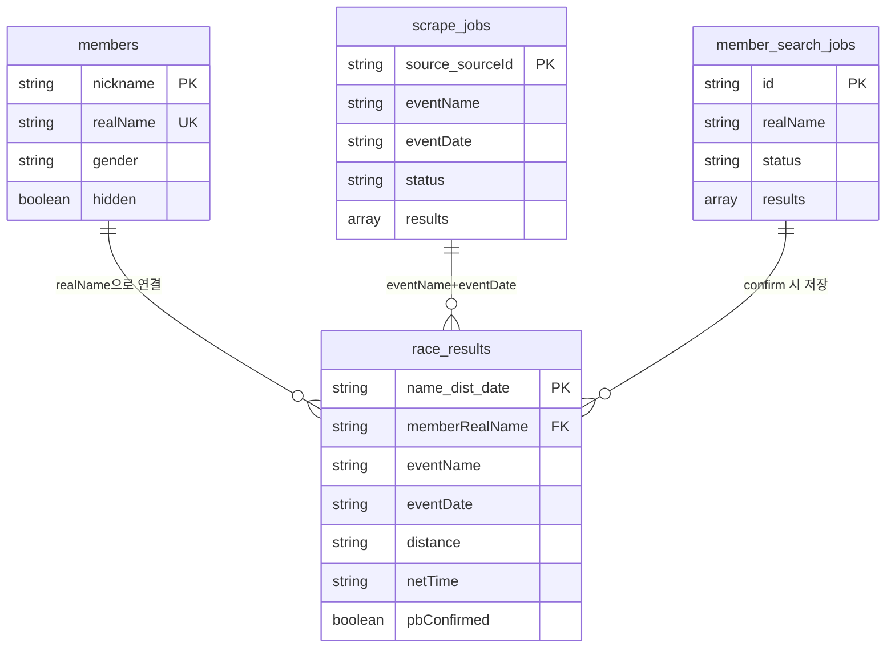

# DMC Attendance Log — Firestore 데이터 모델

## 개요

```
Firestore (dmc-attendance)
├── members            회원 마스터
├── attendance         출석 기록
├── scrape_jobs        대회 스크래핑 작업
├── race_results       ⭐ 확정 대회 기록 (SSOT)
└── member_search_jobs 개인 기록 검색 작업
```

---

## 컬렉션 상세

### 1. `members` — 회원 마스터

| 필드 | 타입 | 설명 |
|------|------|------|
| `nickname` | string | 닉네임 (유니크, 표시용) |
| `realName` | string | 실명 (스크래핑 매칭에 사용) |
| `gender` | string | `"남"` / `"여"` / `""` |
| `team` | string | 팀 코드 |
| `hidden` | boolean | 숨김 (탈퇴/비활성) |

- **Doc ID**: 자동 생성 (랜덤)
- **유니크 제약**: `nickname` (add-member 시 중복 체크)
- **참조**: `race_results.memberRealName` → `members.realName`으로 연결
- **동기화**: `gender` 변경 시 해당 회원의 `race_results.gender`도 일괄 업데이트

---

### 2. `attendance` — 출석 기록

| 필드 | 타입 | 설명 |
|------|------|------|
| `nickname` | string | 닉네임 |
| `nicknameKey` | string | 소문자 검색용 |
| `team` | string | 팀 코드 (`A`~`F`) |
| `teamLabel` | string | 팀 표시명 |
| `meetingType` | string | 정모 타입 (`SAT`, `TUE`, `THU`) |
| `meetingTypeLabel` | string | 정모 표시명 |
| `meetingDateKey` | string | `YYYY/MM/DD` 형식 |
| `monthKey` | string | `YYYY/MM` 형식 |
| `recordedAt` | Timestamp | 기록 시각 |
| `timeText` | string | KST 표시용 시간 |

- **Doc ID**: 자동 생성 (랜덤)

---

### 3. `scrape_jobs` — 대회 스크래핑 작업

| 필드 | 타입 | 설명 |
|------|------|------|
| `source` | string | 타이밍 사이트 (`smartchip`, `spct`, `myresult`, `marazone`, `manual`) |
| `sourceId` | string | 사이트별 이벤트 ID |
| `eventName` | string | 대회명 |
| `eventDate` | string | `YYYY-MM-DD` 형식 |
| `status` | string | `running` → `complete` → `confirmed` |
| `results` | array | 스크래핑 결과 (검토용 원본, ambiguous 포함) |
| `progress` | object | `{ searched, total, found }` |
| `confirmedCount` | number | 확정된 기록 수 |
| `createdAt` | string | ISO 8601 |
| `confirmedAt` | string | ISO 8601 (확정 시각) |
| `location` | string | 장소 (수동 생성 시) |

- **Doc ID**: `{source}_{sourceId}` (결정적 ID)
  - 수동 생성: `manual_manual_{timestamp}`
  - 같은 대회 재스크래핑 시 기존 문서 덮어씀 → 중복 방지
- **상태 흐름**:
  ```
  scrape → running → complete → (사용자 검토) → confirm → confirmed
  create-job → complete → (수동 입력) → confirm → confirmed
  ```

> **주의**: `results` 필드는 검토용 원본 데이터입니다.
> 확정된 기록의 정확한 데이터는 반드시 `race_results`에서 조회하세요.

---

### 4. `race_results` — 확정 대회 기록 ⭐ SSOT

| 필드 | 타입 | 설명 |
|------|------|------|
| `jobId` | string | 출처 scrape_jobs ID |
| `eventName` | string | 대회명 |
| `eventDate` | string | `YYYY-MM-DD` 형식 |
| `source` | string | 타이밍 사이트 |
| `sourceId` | string | 사이트별 이벤트 ID |
| `memberRealName` | string | 회원 실명 |
| `memberNickname` | string | 회원 닉네임 |
| `distance` | string | `full`, `half`, `10K`, `5K` |
| `netTime` | string | Net 기록 (`HH:MM:SS`) |
| `gunTime` | string | Gun 기록 |
| `bib` | string | 배번 |
| `overallRank` | number? | 전체 순위 |
| `gender` | string | `"남"` / `"여"` |
| `pbConfirmed` | boolean | PB 여부 |
| `isGuest` | boolean | 게스트(비회원) 여부 |
| `note` | string | 비고 (수상, 입상 등) |
| `status` | string | 항상 `"confirmed"` |
| `confirmedAt` | string | ISO 8601 |

- **Doc ID**: `{memberRealName}_{distance}_{eventDate}` (결정적 ID)
  - 예: `김성한_10K_2026-03-21`
  - 같은 사람·같은 종목·같은 날짜 → 자동 덮어씀 (중복 방지)
- **SSOT 원칙**: 확정된 기록 조회는 반드시 이 컬렉션에서 수행
  - `action=job` (confirmed): `race_results`에서 조회 후 반환
  - `races.html`: `race_results`에서 직접 조회
  - PB 계산: `race_results`에서 전체 조회 후 산출

---

### 5. `member_search_jobs` — 개인 기록 검색 작업

| 필드 | 타입 | 설명 |
|------|------|------|
| `realName` | string | 검색 대상 실명 |
| `nickname` | string | 검색 대상 닉네임 |
| `status` | string | `running` → `complete` / `failed` |
| `progress` | object | `{ searched, total, currentEvent }` |
| `results` | array | 발견된 이벤트 + 기록 |
| `createdAt` | string | ISO 8601 |
| `completedAt` | string | ISO 8601 |

- **Doc ID**: 자동 생성 (랜덤)
- 사이트별 병렬, 사이트 내 순차 검색
- 검색 완료 후 사용자가 개별 이벤트를 `confirm`하면 `race_results`에 저장

---

## 컬렉션 간 관계



---

## 핵심 설계 원칙

### 1. 결정적 Doc ID로 중복 방지

| 컬렉션 | Doc ID 패턴 | 효과 |
|--------|-------------|------|
| `scrape_jobs` | `{source}_{sourceId}` | 같은 대회 재스크래핑 시 덮어씀 |
| `race_results` | `{이름}_{거리}_{날짜}` | 같은 기록 재확정 시 덮어씀 |

### 2. Single Source of Truth (SSOT)

```
확정 전: scrape_jobs.results (원본 데이터, ambiguous 후보 포함)
확정 후: race_results ⭐ (유일한 진실의 원천)
```

- `action=job` API: confirmed job → `race_results`에서 조회하여 반환
- `scrape_jobs.results`는 확정 후에도 원본으로 남아있을 수 있음 (참고용)

### 3. 데이터 동기화

| 트리거 | 동기화 대상 | 방법 |
|--------|------------|------|
| `members.gender` 변경 | `race_results.gender` | batch update (해당 realName 전체) |
| `confirm` 실행 | `race_results` 생성/갱신 | batch set (결정적 ID) |
| `confirm` 실행 | `scrape_jobs.status` | update → `"confirmed"` |
| `scrape_jobs` ID 변경 | 구 doc 삭제 | batch delete (canonical ID ≠ 기존 ID 시) |

---

## API 엔드포인트 요약

| Action | Method | 주요 컬렉션 | 설명 |
|--------|--------|------------|------|
| `events` | GET | `scrape_jobs` | 대회 목록 (중복 제거 포함) |
| `job` | GET | `scrape_jobs` + `race_results` | 대회 상세 (confirmed → race_results) |
| `scrape` | POST | `scrape_jobs` | 스크래핑 실행 |
| `confirm` | POST | `race_results` + `scrape_jobs` | 기록 확정 |
| `create-job` | POST | `scrape_jobs` | 수동 대회 생성 |
| `members` | GET | `members` | 활성 회원 목록 |
| `all-members` | GET | `members` | 전체 회원 목록 (숨김 포함) |
| `add-member` | POST | `members` | 회원 추가 |
| `update-member` | POST | `members` + `race_results` | 회원 수정 (gender 동기화) |
| `hide-member` | POST | `members` | 회원 숨김 |
| `discover` | GET | 외부 사이트 | 최근 대회 검색 |
| `discover-all` | GET | 외부 사이트 | 전체 대회 검색 |
| `search-member-events` | POST | `member_search_jobs` | 개인 과거 기록 검색 |
| `member-search-job` | GET | `member_search_jobs` | 검색 작업 상태 조회 |
| `confirmed-races` | GET | `race_results` | 확정 기록 조회 (races.html용) |

---

## TODO: memberId 도입

> **상태**: 미착수 | **우선순위**: 다음 개선 사이클

### 배경

현재 `race_results` doc ID가 `{memberRealName}_{distance}_{eventDate}`로, 실명 문자열에 의존한다.
동명이인이 있거나 개명/오타 수정 시 doc ID 자체가 깨진다.

### 결정 사항

| 항목 | 결정 | 근거 |
|------|------|------|
| `memberId` 도입 | **O** | `members` doc ID를 FK로 사용. 동명이인·개명 안전 |
| `events` 컬렉션 신설 | **X** | `scrape_jobs`가 이미 이벤트 메타 + 작업 상태를 관리 중. 분리 이점 없음 |
| 별도 `eventId` 체계 | **X** | 한 대회에 복수 기록 사이트를 쓰는 경우가 없으므로 `source_sourceId`가 곧 eventId |
| `race_results` doc ID | `{memberId}_{distance}_{eventDate}` | 현재 구조에서 realName만 memberId로 교체 |

### 변경 범위

```
race_results doc ID
  Before: {memberRealName}_{distance}_{eventDate}  예: 김성한_10K_2026-03-21
  After:  {memberId}_{distance}_{eventDate}         예: abc123def_10K_2026-03-21
```

- `race_results`에 `memberId` 필드 추가 (기존 `memberRealName`, `memberNickname` 유지)
- `confirm` 액션에서 nickname → members 조회 → memberId 확보 후 doc ID 생성
- `gender` 동기화 쿼리를 `memberId` 기반으로 변경
- PB 계산을 `memberId` 기준 그룹핑으로 변경
- 게스트(비회원) 기록은 `guest_{realName}` 형식의 fallback ID 사용

### 마이그레이션 전략

```
1단계: race_results에 memberId 필드 추가 (기존 doc 유지, 하위 호환)
2단계: confirm 로직에서 memberId 기반 doc ID 사용 시작
3단계: 기존 race_results를 memberId 기반 doc으로 마이그레이션 (atomic batch)
4단계: 구 형식 doc 삭제
```

### 검증 완료

- 동명이인 없음 확인 (154명 전원 실명 고유, 2026-03-21 기준)
- realName → memberId 1:1 매핑 가능

### 미채택 사유 기록

**events 컬렉션 / 소스 무관 eventId**:
하나의 실제 대회를 여러 타이밍 사이트에서 스크래핑하는 운영 사례가 없다.
따라서 `source_sourceId`가 사실상의 eventId이며, 별도 추상화는 불필요한 복잡도를 추가한다.
크로스소스 병합이 필요해지는 시점에 재검토한다.
